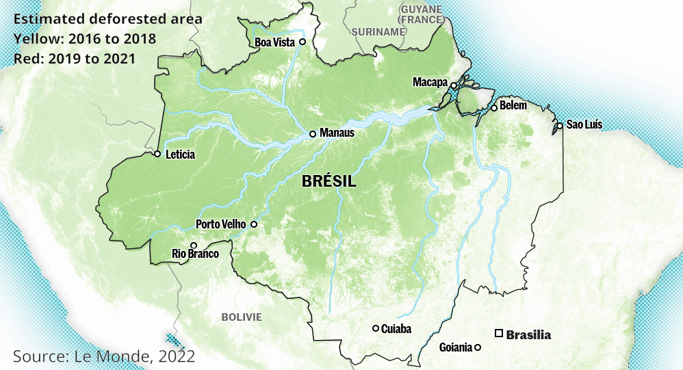

## Context

Fires in Brazil's Amazon rainforest surged in August 2022 to the highest for the month since 2010, government data showed on Wednesday, surpassing the blazes in August 2019 that drew global attention soon after President Jair Bolsonaro took office.

This amount of fire is linked to the deforestation and agricultural practices linked to it (opening of plots, grazing).

Fires are therefore a central issue in the Brazilian presidential election that is being held right now.
