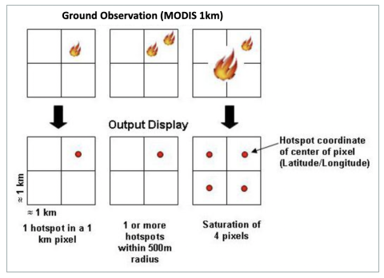

## Data presentation

## Source

The data used for Fire detection is coming from [Nasa - FIRMS](https://pages.github.com/](https://firms.modaps.eosdis.nasa.gov/)

The Fire Information for Resource Management System (FIRMS) distributes Near Real-Time (NRT) active fire data from the Moderate Resolution Imaging Spectroradiometer (MODIS) aboard the Aqua and Terra satellites, and the Visible Infrared Imaging Radiometer Suite (VIIRS) aboard S-NPP and NOAA 20 (formally known as JPSS-1). Globally these data are available within 3 hours of satellite observation, but for the US and Canada active fire detections are available in real-time. 

## Methodology

Satellites take a ‘snapshot’ of events as they pass over earth. Each hotspot/active fire detection represents the center of a 1 km (approx.) pixel flagged as containing one or more fires or other thermal anomalies (such as volcanoes). The “location” is the center point of the pixel (not necessarily the coordinates of the actual fire). The actual pixel size varies with the scan and track (see: What does scan and track mean?). The fire is often less than 1 km in size (see: What size fires can be detected?). We are not able to determine the exact fire size; what we do know is that at least one fire is located within that 1 km pixel. Sometimes you will see several active fires in a line. This generally represents a fire front.

## Data Extraction for the Workshop

Data can be accessed live with WFS or WMS but only for the last 7 days, for older data, [a request needs to be done](https://firms.modaps.eosdis.nasa.gov/download/) focused on a specific area and date. The data can be then submitted as Shapefile, KML or text file.

***For this workshop***, we requested an extraction of historical data for **Brazil, between January, 1st of 2021, and September, 30th of 2022.**
